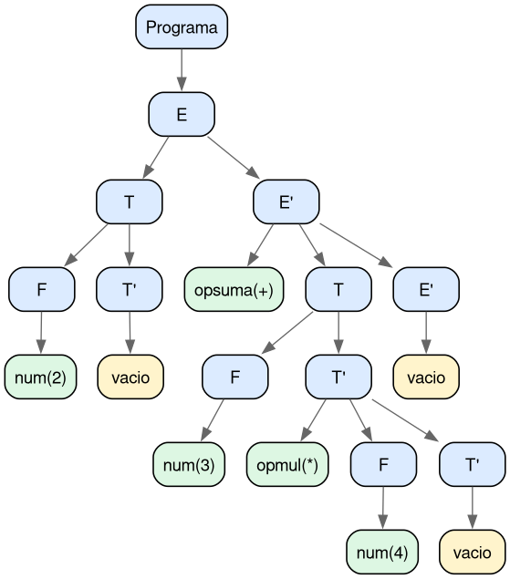
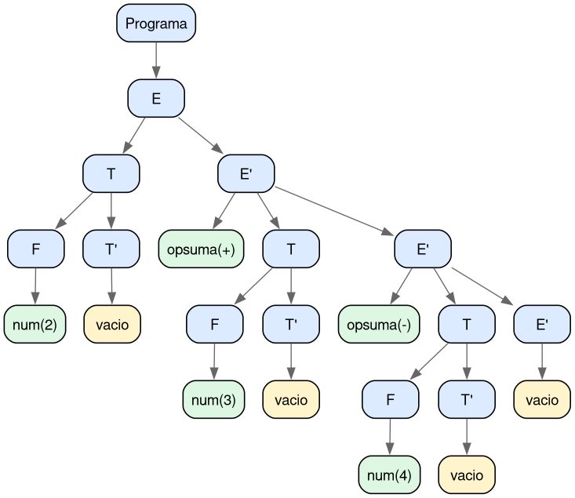
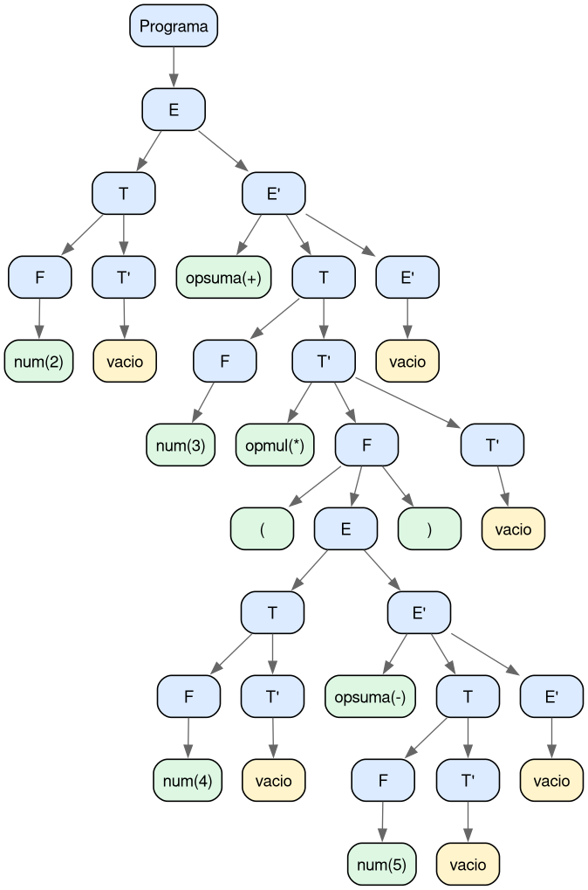

# Tarea 1: Analizador Sintáctico de Expresiones

> Trabajo académico de Compiladores.
> Implementación de un analizador léxico-sintáctico en Python con exportación visual del árbol mediante Graphviz.

Esta tarea evalúa cada línea de entrada, determina si la expresión pertenece al lenguaje definido por la gramática y, cuando es válida, genera su árbol sintáctico en formato PNG.

---

## 1) Gramática utilizada

La gramática fue preparada para análisis descendente (sin recursión por izquierda):

```text
E  -> T E'
E' -> opsuma T E' | epsilon
T  -> F T'
T' -> opmul F T' | epsilon
F  -> id | num | ( E )
```

Terminales considerados:

```text
opsuma: + | -
opmul : * | /
id    : identificadores
num   : enteros
( )   : paréntesis
```

Resumen rápido:

- opsuma: suma y resta.
- opmul: multiplicación y división.
- id y num: operandos.
- paréntesis: delimitan subexpresiones.

---

## 2) Implementación

La solución está separada en tres bloques:

1. Lexer
	Convierte texto en tokens: id, num, opsuma, opmul, (, ), FIN.

2. Parser
	Aplica la gramática con funciones por no terminal.
	E: expresión completa.
	Ep (E prima): continuación de sumas/restas.
	T: término con prioridad de multiplicación/división.
	Tp (T prima): continuación de multiplicaciones/divisiones.
	F: factor atómico (id, num o subexpresión entre paréntesis).
	Si la secuencia de tokens cumple las producciones, se construye el árbol de nodos.

3. Exportador
	Dibuja el árbol con Graphviz y guarda la imagen PNG en salida_arboles.

---

## 3) Construcción del árbol sintáctico (flujo escrito)

Flujo lógico por cada expresión:

1. Leer una línea del archivo de entrada.
2. Ejecutar tokenización en el lexer.
3. Iniciar parseo en el símbolo inicial E.
4. Descender por las producciones.
	E llama a T y luego a E'.
	T llama a F y luego a T'.
	F reconoce id, num o una subexpresión entre paréntesis.
5. En cada paso, crear nodos del árbol y enlazarlos con sus hijos.
6. Si al final se consume FIN sin errores, la expresión es aceptada.
7. Exportar el árbol como imagen PNG.
8. Si ocurre error léxico o sintáctico, marcar la expresión como rechazada y reportar el motivo.

---

## 4) Requisitos

Instalación de dependencias:

```bash
pip install -r requirements.txt
```

Nota: además del paquete de Python, Graphviz debe estar instalado en el sistema para renderizar imágenes.

---

## 5) Ejecución

```bash
python3 analizador_sintactico.py entradas.txt
```

Opción para abrir automáticamente cada imagen al generarla:

```bash
python3 analizador_sintactico.py entradas.txt --abrir
```

Resultado esperado en consola:

- ACEPTADA "expresion" cuando cumple la gramática.
- RECHAZADA "expresion" cuando falla análisis léxico o sintáctico.

---

## 6) Evidencias (imágenes generadas)

### Expresión: 2+3*4 (aceptada)



### Expresión: 2+3-4 (aceptada)



### Expresión: 2+3*(4-5) (aceptada)



Las expresiones rechazadas no generan árbol PNG y se reportan en consola con su error.

---

## 7) Estructura de la tarea

```text
.
├── analizador_sintactico.py
├── entradas.txt
├── gramatica.txt
├── requirements.txt
├── salida_arboles/
└── README.md
```
