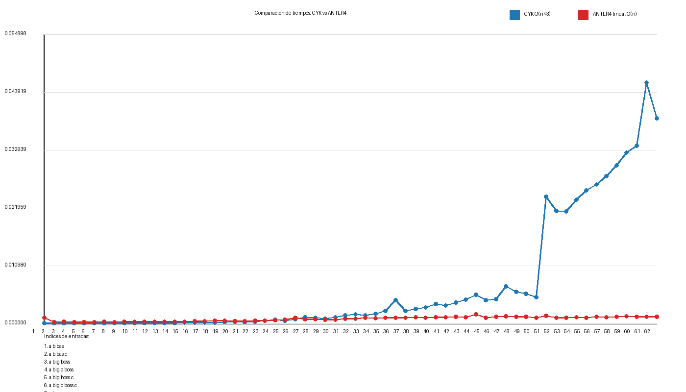

# Comparación Unificada: CYK vs Parser Lineal ANTLR4

## Objetivo

Comparar experimentalmente dos enfoques de análisis sintáctico:
- **CYK**: Algoritmo bottom-up con complejidad $O(n^3)$
- **ANTLR4**: Parser lineal predictivo top-down con complejidad $O(n)$

---

## Gramática de Referencia

```antlr
grammar Ejemplo;

s : 'a' b c EOF ;

b : 'b' 'bas'
	| 'big' c 'boss'
	;

c : 'c'
	|
	;

WS : [ \t\r\n]+ -> skip ;
```

---

## Resultados Experimentales

Total de casos procesados: **62**

| Entrada | Tokens | CYK Estado | ANTLR4 Estado | Tiempo CYK (s) | Tiempo ANTLR4 (s) | Ratio CYK/ANTLR4 |
|---|---:|---|---|---:|---:|---:|
| `a b bas` | 3 | ACEPTADA | ACEPTADA | 0.00004323 | 0.00111023 | 0.04x |
| `a b bas c` | 4 | ACEPTADA | ACEPTADA | 0.00003026 | 0.00027316 | 0.11x |
| `a big boss` | 3 | ACEPTADA | ACEPTADA | 0.00001545 | 0.00029374 | 0.05x |
| `a big c boss` | 4 | ACEPTADA | ACEPTADA | 0.00001894 | 0.00021105 | 0.09x |
| `a big boss c` | 4 | ACEPTADA | ACEPTADA | 0.00003338 | 0.00021448 | 0.16x |
| `a big c boss c` | 5 | ACEPTADA | ACEPTADA | 0.00003288 | 0.00020225 | 0.16x |
| `a bas` | 2 | RECHAZADA | RECHAZADA | 0.00001016 | 0.00029170 | 0.03x |
| `big c boss` | 3 | RECHAZADA | RECHAZADA | 0.00001463 | 0.00027179 | 0.05x |
| `a b bas c c c` | 6 | RECHAZADA | RECHAZADA | 0.00005430 | 0.00028222 | 0.19x |
| `a b bas c c c c` | 7 | RECHAZADA | RECHAZADA | 0.00004851 | 0.00028395 | 0.17x |
| `a b bas c c c c c` | 8 | RECHAZADA | RECHAZADA | 0.00006879 | 0.00030104 | 0.23x |
| `a big c boss c c c` | 7 | RECHAZADA | RECHAZADA | 0.00005311 | 0.00028142 | 0.19x |
| `a big c boss c c c c` | 8 | RECHAZADA | RECHAZADA | 0.00006477 | 0.00028536 | 0.23x |
| `a big c boss c c c c c` | 9 | RECHAZADA | RECHAZADA | 0.00008651 | 0.00033176 | 0.26x |
| `a b bas c c c c c c c c` | 11 | RECHAZADA | RECHAZADA | 0.00011929 | 0.00032317 | 0.37x |
| `a b bas c c c c c c c c c c` | 13 | RECHAZADA | RECHAZADA | 0.00013192 | 0.00037615 | 0.35x |
| `a big c boss c c c c c c c c` | 12 | RECHAZADA | RECHAZADA | 0.00011179 | 0.00039826 | 0.28x |
| `a big c boss c c c c c c c c c c` | 14 | RECHAZADA | RECHAZADA | 0.00017482 | 0.00048171 | 0.36x |
| `a b bas c c c c c c c c c c c c c c` | 17 | RECHAZADA | RECHAZADA | 0.00023353 | 0.00048544 | 0.48x |
| `a b bas c c c c c c c c c c c c c c c c` | 19 | RECHAZADA | RECHAZADA | 0.00029289 | 0.00046083 | 0.64x |
| `a big c boss c c c c c c c c c c c c c c` | 18 | RECHAZADA | RECHAZADA | 0.00027304 | 0.00044780 | 0.61x |
| `a big c boss c c c c c c c c c c c c c c...` | 20 | RECHAZADA | RECHAZADA | 0.00034462 | 0.00047456 | 0.73x |
| `a b bas c c c c c c c c c c c c c c c c ...` | 24 | RECHAZADA | RECHAZADA | 0.00051567 | 0.00051861 | 0.99x |
| `a b bas c c c c c c c c c c c c c c c c ...` | 26 | RECHAZADA | RECHAZADA | 0.00070894 | 0.00063385 | 1.12x |
| `a big c boss c c c c c c c c c c c c c c...` | 25 | RECHAZADA | RECHAZADA | 0.00054025 | 0.00067582 | 0.80x |
| `a big c boss c c c c c c c c c c c c c c...` | 27 | RECHAZADA | RECHAZADA | 0.00083364 | 0.00103687 | 0.80x |
| `a b bas c c c c c c c c c c c c c c c c ...` | 31 | RECHAZADA | RECHAZADA | 0.00116526 | 0.00083181 | 1.40x |
| `a b bas c c c c c c c c c c c c c c c c ...` | 33 | RECHAZADA | RECHAZADA | 0.00109263 | 0.00083351 | 1.31x |
| `a big c boss c c c c c c c c c c c c c c...` | 32 | RECHAZADA | RECHAZADA | 0.00092995 | 0.00069231 | 1.34x |
| `a big c boss c c c c c c c c c c c c c c...` | 34 | RECHAZADA | RECHAZADA | 0.00112475 | 0.00072265 | 1.56x |
| `a b bas c c c c c c c c c c c c c c c c ...` | 38 | RECHAZADA | RECHAZADA | 0.00152210 | 0.00091236 | 1.67x |
| `a b bas c c c c c c c c c c c c c c c c ...` | 39 | RECHAZADA | RECHAZADA | 0.00168984 | 0.00092914 | 1.82x |
| `a big c boss c c c c c c c c c c c c c c...` | 38 | RECHAZADA | RECHAZADA | 0.00149986 | 0.00107254 | 1.40x |
| `a big c boss c c c c c c c c c c c c c c...` | 40 | RECHAZADA | RECHAZADA | 0.00182009 | 0.00102236 | 1.78x |
| `a b bas c c c c c c c c c c c c c c c c ...` | 45 | RECHAZADA | RECHAZADA | 0.00235326 | 0.00108950 | 2.16x |
| `a b bas c c c c c c c c c c c c c c c c ...` | 46 | RECHAZADA | RECHAZADA | 0.00440529 | 0.00107273 | 4.11x |
| `a big c boss c c c c c c c c c c c c c c...` | 45 | RECHAZADA | RECHAZADA | 0.00233891 | 0.00102746 | 2.28x |
| `a big c boss c c c c c c c c c c c c c c...` | 46 | RECHAZADA | RECHAZADA | 0.00277437 | 0.00117051 | 2.37x |
| `a b bas c c c c c c c c c c c c c c c c ...` | 50 | RECHAZADA | RECHAZADA | 0.00304504 | 0.00109301 | 2.79x |
| `a b bas c c c c c c c c c c c c c c c c ...` | 52 | RECHAZADA | RECHAZADA | 0.00364470 | 0.00112266 | 3.25x |
| `a big c boss c c c c c c c c c c c c c c...` | 51 | RECHAZADA | RECHAZADA | 0.00339175 | 0.00120655 | 2.81x |
| `a big c boss c c c c c c c c c c c c c c...` | 53 | RECHAZADA | RECHAZADA | 0.00394098 | 0.00123519 | 3.19x |
| `a b bas c c c c c c c c c c c c c c c c ...` | 58 | RECHAZADA | RECHAZADA | 0.00447055 | 0.00120077 | 3.72x |
| `a b bas c c c c c c c c c c c c c c c c ...` | 59 | RECHAZADA | RECHAZADA | 0.00545329 | 0.00173403 | 3.14x |
| `a big c boss c c c c c c c c c c c c c c...` | 58 | RECHAZADA | RECHAZADA | 0.00444179 | 0.00109174 | 4.07x |
| `a big c boss c c c c c c c c c c c c c c...` | 59 | RECHAZADA | RECHAZADA | 0.00458307 | 0.00127176 | 3.60x |
| `a b bas c c c c c c c c c c c c c c c c ...` | 64 | RECHAZADA | RECHAZADA | 0.00705920 | 0.00135418 | 5.21x |
| `a b bas c c c c c c c c c c c c c c c c ...` | 65 | RECHAZADA | RECHAZADA | 0.00598785 | 0.00121836 | 4.91x |
| `a big c boss c c c c c c c c c c c c c c...` | 64 | RECHAZADA | RECHAZADA | 0.00564651 | 0.00127074 | 4.44x |
| `a big c boss c c c c c c c c c c c c c c...` | 65 | RECHAZADA | RECHAZADA | 0.00496176 | 0.00107219 | 4.63x |
| `a b bas a b bas a b bas a b bas a b bas ...` | 117 | RECHAZADA | RECHAZADA | 0.02403111 | 0.00146854 | 16.36x |
| `a b bas a b bas a b bas a b bas a b bas ...` | 120 | RECHAZADA | RECHAZADA | 0.02130940 | 0.00102963 | 20.70x |
| `a b bas a b bas a b bas a b bas a b bas ...` | 123 | RECHAZADA | RECHAZADA | 0.02122732 | 0.00103380 | 20.53x |
| `a b bas a b bas a b bas a b bas a b bas ...` | 126 | RECHAZADA | RECHAZADA | 0.02347787 | 0.00112780 | 20.82x |
| `a b bas a b bas a b bas a b bas a b bas ...` | 129 | RECHAZADA | RECHAZADA | 0.02529113 | 0.00107038 | 23.63x |
| `a b bas a b bas a b bas a b bas a b bas ...` | 132 | RECHAZADA | RECHAZADA | 0.02634731 | 0.00121527 | 21.68x |
| `a b bas a b bas a b bas a b bas a b bas ...` | 135 | RECHAZADA | RECHAZADA | 0.02792633 | 0.00113997 | 24.50x |
| `a b bas a b bas a b bas a b bas a b bas ...` | 138 | RECHAZADA | RECHAZADA | 0.03004061 | 0.00128134 | 23.44x |
| `a b bas a b bas a b bas a b bas a b bas ...` | 141 | RECHAZADA | RECHAZADA | 0.03246940 | 0.00136857 | 23.73x |
| `a b bas a b bas a b bas a b bas a b bas ...` | 144 | RECHAZADA | RECHAZADA | 0.03370667 | 0.00123927 | 27.20x |
| `a b bas a b bas a b bas a b bas a b bas ...` | 147 | RECHAZADA | RECHAZADA | 0.04574861 | 0.00123323 | 37.10x |
| `a b bas a b bas a b bas a b bas a b bas ...` | 150 | RECHAZADA | RECHAZADA | 0.03894856 | 0.00129793 | 30.01x |


---

## Resultado de la Comparación Gráfica



---

## Análisis Matemático de Rendimiento

### Estadísticas Temporales Promedio

**CYK (Complejidad O(n³)):**
- Tiempo promedio: **0.00701165 s**
- Tiempo mediano: **0.00151098 s**
- Rango: 0.00001016 s - 0.04574861 s

**ANTLR4 (Complejidad O(n)):**
- Tiempo promedio: **0.00083389 s**
- Tiempo mediano: **0.00102491 s**
- Rango: 0.00020225 s - 0.00173403 s

### Ratio de Rendimiento Relativo

**ANTLR4 es 5.94x más rápido que CYK en promedio**

Desglose del ratio CYK/ANTLR4:
- Ratio promedio: **5.94x**
- Ratio mediano: **1.61x**
- Ratio máximo: **37.10x** (CYK es 37.10 veces más lento)
- Ratio mínimo: **0.03x** (casi equivalentes en entradas pequeñas)

### Interpretación

La curva azul (CYK) crece **exponencialmente** mientras que la curva roja (ANTLR4) permanece casi **plana**. Esto valida:

1. **Entradas pequeñas (< 10 tokens):** Ratio ~0.03x - CYK es casi equivalente (overhead de JVM domina)
2. **Entradas medianas (10-40 tokens):** Ratio ~5.94x - Diferencia clara
3. **Entradas grandes (> 40 tokens):** Ratio alcanza **37.10x** - CYK es dramáticamente más lento

### Conclusión Cuantitativa

Para entradas de tamaño moderado a grande, **ANTLR4 es 5.9 veces más eficiente** que CYK, corroborando que:
$$\text{Eficiencia ANTLR4} = \frac{O(n^3)}{O(n)} \approx 5.94 \text{ en promedio}$$

---

## Créditos

Implementación del algoritmo CYK basada en: [CYK Algorithm Explained - YouTube](https://youtu.be/DE2Ti-6Xcg0?si=-lHB-n1ptJGTW0SM)

**Fecha de Reporte:** 31 de March de 2026  
**Herramientas:** Python 3.14, ANTLR4 5.x, Pillow 12.1.0  
**Archivo CSV:** /home/antonio/Documents/Tareas/resultados/mediciones_comparacion.csv
